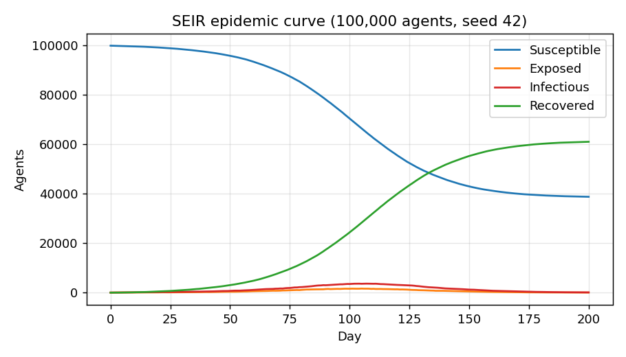

# Multi-Layer Digital Twin Framework for Modeling Influenza Spread

An agent-based simulation engine in **Java** that models influenza spreading through a synthetic population connected by three contact layers: **households**, **schools/workplaces** and **community**. Each person is an individual agent in an SEIR (Susceptible → Exposed → Infectious → Recovered) disease model.



## Features
- Multi-layer contact network (household, school/workplace, community) generated from a seed
- SEIR disease progression with configurable latent and infectious periods
- Two interchangeable contact engines (Strategy pattern): a naive baseline and an optimised infectious-driven sampler
- Deterministic runs: the same seed always gives the same result
- Compact memory layout: byte/int arrays and CSR-style group storage instead of one object per agent
- Dependency-free tests and a built-in benchmark; CSV output for analysis

## Quick start (JDK 17+)
```bash
./build.sh test                              # run the test suite
./build.sh run 100000 200 42 results.csv     # agents, days, seed, output file
./build.sh bench                             # naive vs optimised benchmark
```

## Design
| Class | Responsibility |
|---|---|
| `Config` | Immutable parameters (record) |
| `Population` | Generates agents and their group memberships |
| `Layer` | One contact layer, members stored in compressed (CSR) arrays for O(1) group access |
| `ContactEngine` | Strategy interface for deciding who is exposed each day |
| `SamplingContactEngine` | Optimised: only infectious agents drive work, O(infectious × contacts) |
| `NaiveContactEngine` | Baseline: every susceptible agent scans its groups, O(population × group size) |
| `Simulation` | Daily step loop and SEIR state transitions, reuses buffers each day |
| `Main`, `Benchmark` | CLI entry points |

**Optimisation idea:** early and late in an epidemic, most agents are not infectious. The sampling engine therefore iterates over infectious agents only, contacting all household members and a small random sample in other layers, instead of every susceptible agent scanning its whole group.

## Results
Measured on a single-core Linux container, JDK 21, 200 simulated days, median of 3 runs
(`docs/benchmark.md`, reproduce with `./build.sh bench`):

| Agents | Naive (s) | Sampling (s) | Speed-up | Runtime reduction | Final attack rate naive / sampling |
|---:|---:|---:|---:|---:|:---|
| 10,000 | 0.42 | 0.02 | 19.4x | 95% | 62.7% / 59.2% |
| 50,000 | 2.41 | 0.11 | 21.5x | 95% | 63.7% / 60.3% |
| 100,000 | 4.97 | 0.23 | 22.0x | 95% | 62.6% / 61.4% |
| 250,000 | 14.08 | 0.59 | 23.7x | 96% | 63.2% / 59.7% |

A single run of **1,000,000 agents × 200 days** takes about **4.2 s** with the sampling engine.
Both engines produce epidemics of similar size (attack rates within a few points), so the speed-up is not
bought by changing the outcome. Absolute times depend on your machine; the ratios are what matter.

## Testing
`./build.sh test` checks group sizes, population conservation (S+E+I+R = N every day), monotonic
susceptible/recovered counts, determinism for a fixed seed, no spread when transmission is 0, and
agreement between the two engines.

## Limitations
Transmission parameters are illustrative, not calibrated to real surveillance data. Age structure and
interventions (vaccination, school closure) are not modelled yet.

## Roadmap
- Age-stratified agents and age-specific contact rates
- Interventions: vaccination, school closures, isolation
- Calibration against real influenza surveillance data
- Parallel step execution and a JUnit/Maven build
